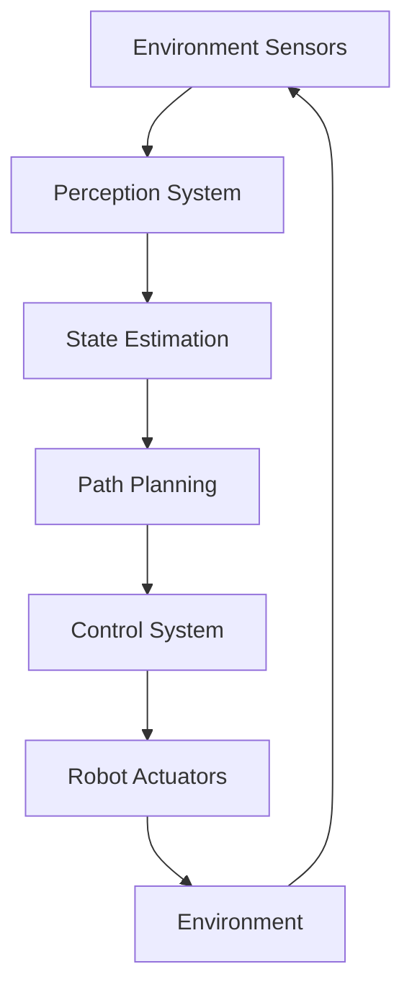

# Examples

## Example 1: Autonomous Navigation

Let's examine a simple example of Physical AI in action: an autonomous robot navigating through a cluttered environment.

### Problem Statement
An autonomous robot needs to navigate from point A to point B in an environment with obstacles, while avoiding collisions and reaching its destination efficiently.

### Solution Components



### Implementation Steps

1. **Sensor Fusion**: Combine data from multiple sensors (LIDAR, cameras, IMU)
2. **Mapping**: Create a representation of the environment
3. **Path Planning**: Compute a safe and efficient path to the goal
4. **Control**: Generate motor commands to follow the planned path
5. **Feedback**: Continuously update based on sensor input

### Code Example

```javascript
// Simplified navigation algorithm
class NavigationSystem {
  constructor() {
    this.map = new OccupancyGrid();
    this.pathPlanner = new AStarPlanner();
    this.controller = new PurePursuitController();
  }

  navigateToGoal(robotPose, goalPose) {
    // Update map with latest sensor data
    this.updateMap();

    // Plan path from current position to goal
    const path = this.pathPlanner.plan(this.map, robotPose, goalPose);

    // Follow the planned path
    this.controller.followPath(path);
  }
}
```

## Example 2: Object Manipulation

Physical AI is also essential for robotic manipulation tasks.

### Problem Statement
A robot arm needs to pick up objects of varying shapes, sizes, and materials from a cluttered bin.

### Key Considerations
- Grasp planning based on object geometry
- Force control to handle fragile items
- Visual servoing for precision placement
- Adaptation to object variations

### Real-World Application
Amazon's warehouse robots use Physical AI principles to efficiently pick and place items, demonstrating the practical value of these techniques.

## Example 3: Human-Robot Collaboration

Modern Physical AI systems often work alongside humans in collaborative environments.

### Scenario
A robot assistant helps a human in an assembly task, anticipating needs and providing appropriate tools.

### Key Technologies
- Intent recognition from human behavior
- Safe motion planning around humans
- Adaptive interfaces for communication
- Shared control strategies

## Simulation vs. Reality

### Simulation Benefits
- Safe testing environment
- Fast iteration cycles
- Cost-effective development
- Controlled experiments

### Reality Challenges
- Sensor noise and uncertainty
- Dynamic environments
- Unmodeled physics
- Safety considerations

### Bridging the Gap
- Domain randomization in simulation
- System identification techniques
- Transfer learning methods
- Sim-to-real algorithms