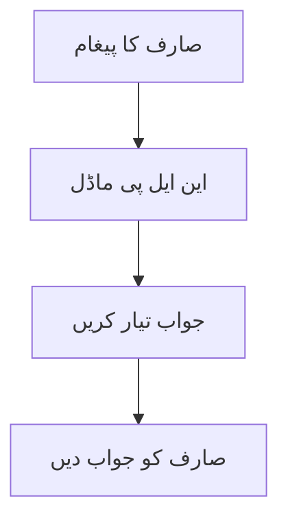
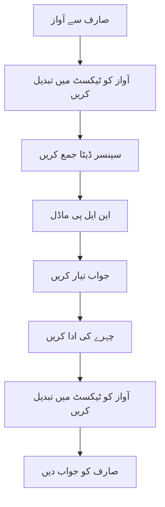

# مثالیں

## ڈیجیٹل ورچوئل واقعہ کے مقابلے میں حقیقی دنیا

### ڈیجیٹل ورچوئل واقعہ

```python
# تصویر کے ساتھ کام کرنا
def recognize_object(image_data):
    # تصویر کے اندر اشیاء کو پہچاننا
    objects = detect_objects(image_data)
    return objects
```

### جسمانی ورچوئل واقعہ

```python
# ایک روبوٹ کے ساتھ کام کرنا
def grasp_object(robot_arm, object_location):
    # روبوٹ کو حرکت کے لیے کہنا
    robot_arm.move_to(object_location)
    # اشیاء کو تھامنا
    robot_arm.grasp()
    # کامیابی کی تصدیق
    return robot_arm.is_grasping_success()
```

## میکانکس کا میز

| عنصر | ڈیجیٹل ای آئی | فزیکل ای آئی |
|-------|----------------|----------------|
| ان پٹ | ڈیٹا، ٹیکسٹ، تصاویر | سینسر ڈیٹا، ویژن، آواز، چھو |
| آؤٹ پٹ | ٹیکسٹ، تصاویر، اشارے | حرکات، گفتگو، جسمانی کارروائی |
| ماحول | ڈیجیٹل | حقیقی دنیا |
| ایرر کا اثر | کم | زیادہ (میکانک خرابی) |
| وقت کی پابندی | کم | زیادہ (حقیقی وقت) |
| توانائی کی کھپت | کم | زیادہ (میکانک حرکات) |

## ڈیجیٹل ورچوئل واقعہ کا میز

| ایپلی کیشن | ڈیجیٹل ای آئی | فزیکل ای آئی |
|-------------|----------------|----------------|
| تشخیص | تصاویر میں اشیاء کو پہچاننا | اشیاء کو تلاش کرنا اور تھامنا |
| گفتگو | چیٹ بوٹ | بات چیت کرنے والا روبوٹ |
| گیم | چیس کھیلنا | فوٹ بال کھیلنا |

## ڈیزائن کے اصول

### 1. احتیاط کا اصول
> جب کوئی کارروائی نا معلوم ہو تو، سب سے محفوظ راستہ اختیار کریں

```python
def safe_move(robot, target_pos):
    # پہلے راستہ کلیئر ہے یا نہیں چیک کریں
    if not path_is_clear(robot.position, target_pos):
        return False

    # سست حرکت کریں
    robot.move_slowly(target_pos)
    return True
```

### 2. انسان کی ترجیح
> جہاں کوئی خطرہ ہو، وہاں انسان کو ترجیح دیں

### 3. سیکھنے کا عمل
> روبوٹ کو اپنے تجربات سے سیکھنے کی اجازت دیں

## میکانک ڈرائیو کے میز

| ٹاسک | چیلنج | حل |
|-------|--------|-----|
| اشیاء کو تھامنا | مختلف اشکال اور وزن | ایڈاپٹیو گریپرز |
| چلنا | عدم مستحکم سطح | متوازن الگورتھم |
| بات چیت | شور کا ماحول | بیم فارمنگ مائیکروفون |

## ڈیجیٹل ورچوئل واقعہ کے مقابلے میں جسمانی ورچوئل واقعہ کا ڈیجیکٹر

### ڈیجیکٹر: چیٹ بوٹ



### جسمانی ورچوئل واقعہ: گفتگو کا روبوٹ



## مثالی کوڈ

### ایک سادہ فزیکل ای آئی کا نظام

```python
class PhysicalAIAgent:
    def __init__(self):
        self.sensors = SensorArray()
        self.actuators = ActuatorSystem()
        self.ai_model = DeepLearningModel()

    def perceive_environment(self):
        sensor_data = self.sensors.read_all()
        return sensor_data

    def act(self, action):
        success = self.actuators.execute(action)
        return success

    def learn_from_interaction(self, state, action, reward):
        self.ai_model.update(state, action, reward)

    def decide_action(self, perception):
        action = self.ai_model.predict(perception)
        return action
```

### ایک روبوٹ کے ساتھ تعامل

```python
# ایک روبوٹ کے ساتھ تعامل کا مثالی کوڈ
robot = PhysicalAIAgent()

while True:
    # ماحول کا جائزہ لیں
    perception = robot.perceive_environment()

    # کارروائی کا فیصلہ کریں
    action = robot.decide_action(perception)

    # کارروائی کریں
    success = robot.act(action)

    # نتیجہ کو سیکھنے کے لیے استعمال کریں
    reward = evaluate_action_outcome(success)
    robot.learn_from_interaction(perception, action, reward)
```

## حوالہ جات

- [Physical AI Research Paper](https://arxiv.org/abs/2103.12291)
- [Embodied Intelligence Framework](https://embodied-intelligence.org/)
- [Robot Learning Examples](https://robot-learning.cs.uni-freiburg.de/)